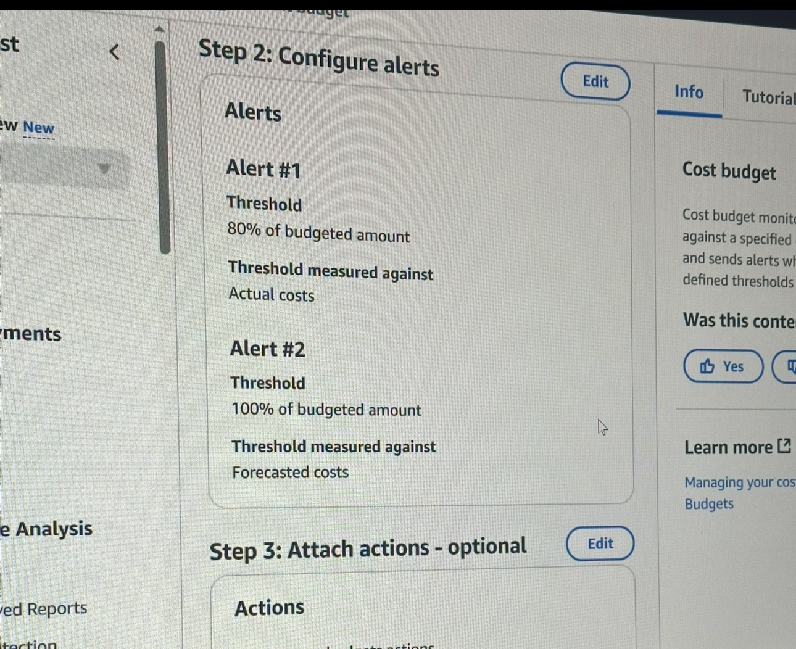

AWS S3 + CloudFront Static Website (Portfolio Project 1)

Overview
A fully deployed static website hosted on Amazon S3 and distributed globally via Amazon CloudFront, using an Origin Access Control (OAC) for security.

## AWS Services Used
- **S3** – Static website storage
- **CloudFront** – Global CDN with HTTPS
- **ACM** – TLS certificate (if using custom domain)
- **IAM** – Bucket policy restricted to CloudFront
- **AWS CLI** – Deployment automation

## Features
- Custom 404 error page
- AWS managed SecurityHeadersPolicy
- Versioned S3 bucket for rollback
- Cache-optimized deployment (no-cache HTML, long-cache assets)

## Deployment Steps
1. Create S3 bucket with static hosting enabled
2. Uploaded 'index html' and '404 HTML' with correct 'ContentType'
3. Create CloudFront distribution with OAC and link to bucket
4. Attach SecurityHeadersPolicy
5. Invalidate CloudFront cache after updates

## Live Demo
[https://d24lku7z6siz5i.cloudfront.net](https://d24lku7z6siz5i.cloudfront.net)

## Author
Andrew Kremmidas – AWS Solutions Architect Associate

